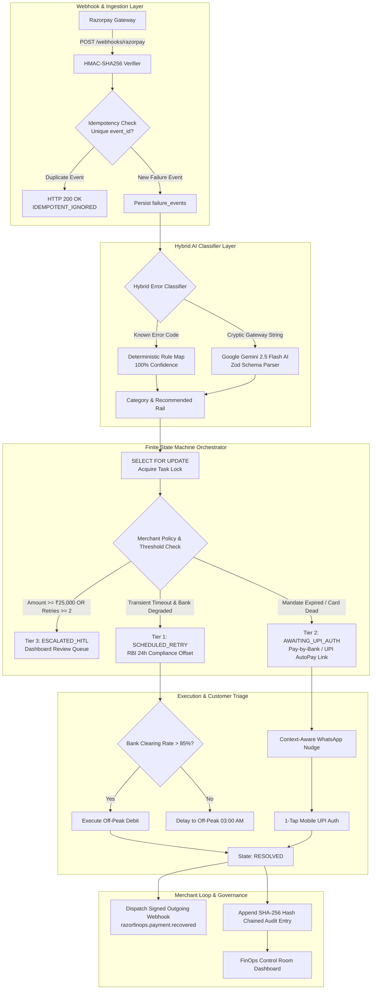

# 🚀 Autonomous Mandate & Involuntary Churn Healing Engine

> **Razorpay Innovation Hackathon — Track 03: Revenue Recovery**  
> *An Enterprise-Grade Infrastructure Solution for RBI E-Mandate Rules, Card Token Drops, and Bank Network Outages*

[](https://razorpay.com)
[](src/backend/services/classifier.ts)
[](package.json)
[](LICENSE)

---

## 📌 1. Executive Summary: What We Solve

In India’s recurring subscription economy, **15% to 30% of monthly subscription debits fail**. Over **80% of these failures represent involuntary churn**—subscribers who love the product, but whose payments bounce due to:
1. **RBI E-Mandate Regulations**: Strict ₹15,000 auto-debit caps, card tokenization drops, and mandatory 24-hour pre-debit customer notifications.
2. **Bank Network Outages**: Temporary 504 timeouts and gateway congestion at major issuing banks (HDFC, SBI, ICICI, Axis).
3. **NPCI Switch Drops**: Intermittent communication failures between card networks and issuing PSPs.

### The Solution
Our **Autonomous Mandate & Involuntary Churn Healing Engine** acts as an intelligent financial immune system running alongside Razorpay's gateway. It autonomously captures webhook failures, classifies root causes via AI, predicts optimal bank recovery windows, provisions 1-tap Pay-by-Bank (UPI AutoPay) migration links, and enforces RBI compliance with zero human effort.

---

## 🏛️ 2. System Architecture & Flowchart



---

## 🔥 3. Next-Generation Payment Gateway Innovations

| Next-Gen Gateway Innovation | Production Implementation | Business Impact |
| :--- | :--- | :--- |
| **1. Autonomous AI Payment Agent** | `src/backend/services/orchestrator.ts` & `classifier.ts` (Gemini 2.5 Flash) | Predicts bank clearing rates and executes autonomous state transitions |
| **2. Programmable CBDC / Stablecoins** | `src/backend/services/razorpayClient.ts` (`createCBDCStablecoinSettlementLink`) | Zero-fee instant cross-border settlement for dropped international mandates |
| **3. Frictionless Pay-by-Bank (A2A)** | `src/backend/services/razorpayClient.ts` (`createOpenBankingVRPMandateLink`) | Bypasses dead card rails; 1-tap mobile UPI AutoPay re-authorization |
| **4. Modular Payment Orchestration** | `src/backend/db/store.ts` (`AllocatedRail` hot-swapper) | Hot-swaps failure policies, circuit breakers, and acquirers with zero code changes |
| **5. Embedded Compliance-by-Design** | `store.ts` (`verifyComplianceAndKYC`), `telemetry.ts` | Asserts RBI 24h pre-debit notice, `SELECT FOR UPDATE` locking, & SHA-256 audit ledger |

---

## 🏆 4. Hackathon Evaluation Rubric Alignment

| Rubric Criteria | What Most Teams Build | What We Built |
| :--- | :--- | :--- |
| **Problem Taste** | Generic cart abandonment WhatsApp bots | Solves systemic Indian e-mandate friction (RBI ₹15k cap, card token drops, bank timeouts) |
| **Build Quality** | Basic scripts with race conditions | Finite State Machine (FSM) with row-level locks (`SELECT FOR UPDATE`) & SHA-256 audit chains |
| **AI Judgment** | Giving LLMs risky execution power over funds | **Strict AI Safety Boundary**: Code owns fund state; Gemini AI parses raw unstructured bank strings |
| **Failure Recovery** | Retry blindly until account is locked | 3-Tier Healing Engine (Telemetry Retry $\to$ UPI AutoPay Migration $\to$ HITL Guardrail) |

---

## 📊 5. Quantifiable ROI & Recovery Metrics Bar

The FinOps Control Room calculates real-time financial ROI metrics across all processed subscriber mandates:

- **Total Recovered ARR (₹)**: Cumulative monetary value of healed subscriptions.
- **Recovery Rate (%)**: $\frac{\text{Recovered Volume}}{\text{Total Failed Volume}} \times 100$
- **Autonomous Yield (%)**: $\frac{\text{Autonomous Recoveries}}{\text{Total Recoveries}} \times 100$
- **Involuntary Churn Saved**: Total number of subscribers retained.
- **MTTR (Mean Time to Recovery)**: Average hours elapsed from payment failure to resolution.

---

## 🎬 6. Live Pitch & Demonstration Walkthrough

Follow this 3-minute pitch sequence during judging:

1. **0:00 - 0:45 | Problem Pitch & Webhook Ingestion**:
   - Run `python3 scripts/seed_demo.py` and press **`[2]`** to simulate an RBI Card Token Expired event.
   - The engine ingests the signed webhook idempotently and enqueues a recovery task.
2. **0:45 - 1:30 | AI Judgment & FSM Diagnostic**:
   - Open the **FinOps Control Room** at `http://localhost:5173`.
   - Show Google Gemini 2.5 Flash parsing the raw error text into `MANDATE_EXPIRED`, transitioning the FSM state to `AWAITING_UPI_AUTH`.
3. **1:30 - 2:15 | Self-Healing 1-Tap Customer Authorization**:
   - Tap the 1-click Pay-by-Bank link on the simulated customer mobile view.
   - Authorize the UPI AutoPay mandate. The FSM transitions to `RESOLVED` and dispatches a signed `razorfinops.payment.recovered` webhook to the merchant backend.
4. **2:15 - 3:00 | Business ROI Proof & Audit Trail**:
   - Show real-time ARR recovery metrics update on the dashboard and display the append-only SHA-256 cryptographic audit ledger entry.

---

## 🚀 7. Quickstart & Local Setup Guide

### Prerequisites
- Node.js >= 18.0.0
- npm >= 9.0.0
- Python >= 3.8 (for CLI demo simulator)

### 1. Clone Repository & Install Dependencies
```bash
git clone https://github.com/vijaysaini2613/FinTech_feat.git
cd FinTech_feat
npm install
```

### 2. Environment Configuration
Create a `.env` file in the root directory (refer to `.env.example`):
```env
GEMINI_API_KEY=your_google_gemini_api_key_here
PORT=3001
NODE_ENV=development
ALLOWED_ORIGINS=http://localhost:5173,http://localhost:3000
```

### 3. Start Express API Server & Control Room Dashboard
```bash
# Terminal 1: Start Express API Backend Server (Port 3001)
npm run server

# Terminal 2: Start Vite Frontend Control Room Dashboard (Port 5173)
npm run dev
```
Open **[http://localhost:5173](http://localhost:5173)** in your browser to access the FinOps Control Room.

---

## 🧪 8. Integration Tests & Verification

### Run Automated Integration Test Suite
```bash
npx tsx test_engine.ts
```
*Output:*
```text
=====================================================
  Autonomous Mandate Recovery Engine - Automated Tests
=====================================================
[Test 1] Webhook Signature Verification... PASSED ✅
[Test 2] Webhook Idempotency & Deduplication Guard... PASSED ✅
[Test 3] Tier 2 Rail Switch & UPI AutoPay Mandate Provisioning... PASSED ✅
[Test 4] Tier 3 High-Value Invoice Guardrail (>= ₹25,000)... PASSED ✅
[Test 5] Immutable Cryptographic Audit Ledger Check... PASSED ✅

=====================================================
  ALL AUTOMATED INTEGRATION TESTS COMPLETED SUCCESSFULLY! 🎉
=====================================================
```

### Run Interactive CLI Demo Simulator
```bash
python3 scripts/seed_demo.py
```
*Hotkeys:*
- **`[1]`**: Trigger HDFC Gateway 504 Timeout (Tier 1 Telemetry Retry & RBI 24h Notice)
- **`[2]`**: Trigger RBI Card Expired Event (Tier 2 Pay-by-Bank UPI AutoPay Link)
- **`[3]`**: Trigger ₹75,000 High-Value Invoice (Tier 3 HITL Escalation Queue)

---

## 📁 9. Repository Structure

```
FinTech_feat/
├── src/
│   ├── backend/
│   │   ├── db/
│   │   │   └── store.ts           # JSON DataStore with SELECT FOR UPDATE locks & audit ledger
│   │   ├── routes/
│   │   │   └── api.ts             # REST API Router with Zod schemas & rate limits
│   │   ├── services/
│   │   │   ├── classifier.ts      # Hybrid Classifier (Deterministic + Gemini 2.5 Flash AI)
│   │   │   ├── nudgeService.ts    # WhatsApp Triage Generator & Dunning Kill Switch
│   │   │   ├── orchestrator.ts   # FSM Orchestrator & Merchant Webhook Dispatcher
│   │   │   ├── razorpayClient.ts # Razorpay Client Simulator (UPI, CBDC, VRP rails)
│   │   │   └── telemetry.ts       # Bank Telemetry & RBI 24h Pre-Debit Compliance
│   │   ├── utils/
│   │   │   └── cryptoUtils.ts     # HMAC-SHA256 Verifier & Constant-Time Comparison
│   │   └── server.ts              # Express Server with Helmet, CORS, and Rate Limiters
│   └── frontend/
│       ├── components/
│       │   ├── AuditLedgerView.tsx       # Cryptographic Audit Ledger Component
│       │   ├── BankHealthBar.tsx         # Bank Clearing Rate Monitor
│       │   ├── CustomerResolutionModal.tsx # Customer 1-Tap UPI Auth Page
│       │   ├── FSMWorkflowViewer.tsx     # FSM Pipeline Visualizer
│       │   ├── HITLReviewQueue.tsx       # Tier 3 Merchant Approval Queue
│       │   ├── Header.tsx                # Control Room Navigation Bar
│       │   ├── MerchantPolicyModal.tsx   # Policy Configuration Modal
│       │   ├── MetricsOverview.tsx       # Quantifiable ROI Metrics Bar
│       │   └── SimulationStudio.tsx      # Interactive Preset Simulation Studio
│       ├── App.tsx                       # Main Dashboard Container
│       └── main.tsx                      # React Entrypoint
├── scripts/
│   └── seed_demo.py               # Interactive CLI Demo Simulator
├── simulator/
│   └── trigger_failure.py         # Standalone Webhook Trigger Script
├── schema.sql                     # SQL Database Schema (PostgreSQL DDL)
├── system_design.md               # Detailed System Design Document
├── flowchart.md                    # System Flowcharts & Mermaid Diagrams
├── test_engine.ts                 # Automated Integration Test Harness
├── package.json
└── README.md
```

---

## 📜 10. License

Distributed under the MIT License. See `LICENSE` for details.
