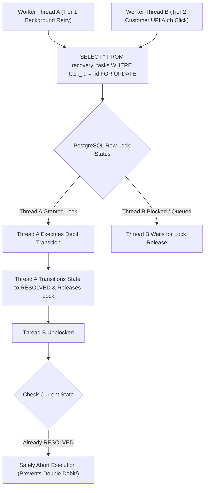
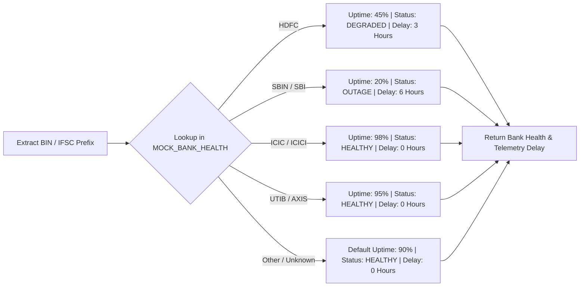

# Comprehensive System Flowcharts
## Autonomous Mandate & Involuntary Churn Healing Engine (Track 03: Revenue Recovery)

This document contains full Mermaid flowcharts detailing the complete lifecycle architecture, row-level concurrency locking defense (`SELECT FOR UPDATE`), mock bank telemetry index lookup (`MOCK_BANK_HEALTH`), RBI 24-hour pre-debit compliance workflow, Dunning rate-limiting policy & kill switch, merchant outgoing webhook dispatcher, FSM state transitions, and the 3-minute live pitch demo sequence.

---

## 1. High-Level System Architecture Flowchart

```mermaid
flowchart TD
    subgraph Gateway ["Razorpay Webhook Gateway / scripts/seed_demo.py (Hotkeys 1, 2, 3)"]
        WH["Razorpay API / CLI Harness"]
    end

    subgraph Phase1 ["Phase 1: Deterministic Ingestion & Security"]
        SIG{"Verify HMAC-SHA256 Signature"}
        IDEM{"Idempotency Check (failure_events.event_id)"}
        ING_LOG["Log Event & Initialize Task (DETECTED)"]
    end

    subgraph Concurrency ["Concurrency Defense Layer"]
        LOCK{"Acquire Row Lock (SELECT FOR UPDATE)"}
    end

    subgraph Phase2 ["Phase 2: Hybrid AI Error Classification"]
        DIAG["Transition to DIAGNOSING"]
        KNOWN{"Known Error Code?"}
        RULE_ENG["Deterministic Rule Engine"]
        LLM_PARSER["Constrained LLM Semantic Parser (Zod Schema Output)"]
        CLASS_OUT["Failure Classification Result"]
    end

    subgraph Phase3 ["Phase 3: FSM Policy & Compliance Guardrails"]
        GUARD{"Invoice >= ₹25k OR Retries >= 2?"}
        TRANS{"Is Failure Transient (e.g. 504 Timeout)?"}
        HARD{"Is Mandate Expired / Revoked?"}
        RBI_CHECK{"RBI Pre-Debit Notice Sent >= 24h Ago?"}
        DUNNING_CAP{"Dunning Nudge Count < 2?"}
    end

    subgraph Recovery ["Phase 4: 3-Tier Execution Engine"]
        T1["Tier 1: Telemetry-based Off-Peak Retry (SCHEDULED_RETRY)"]
        T2["Tier 2: Provision UPI AutoPay Mandate Link + WhatsApp Nudge (AWAITING_UPI_AUTH)"]
        T3["Tier 3: Merchant HITL Approval Queue (ESCALATED_HITL)"]
    end

    subgraph Resolution ["Phase 5: Resolution, Merchant Handshake & Audit"]
        KILL{"Customer Clicked Cancel Subscription?"}
        RES["Payment Healed / Authorized (RESOLVED)"]
        EXH["72h Expired / Customer Cancelled (EXHAUSTED)"]
        DISPATCH["Merchant Webhook Dispatcher: Emit razorfinops.payment.recovered"]
        LEDGER[("Append-Only Cryptographic Audit Ledger")]
        UNLOCK["Release Task Row Lock"]
    end

    WH --> SIG
    SIG -- "Invalid" --> REJ["HTTP 401 Unauthorized (Reject Payload)"]
    SIG -- "Valid" --> IDEM
    IDEM -- "Duplicate" --> IDEM_RES["HTTP 200 OK (Return Idempotent Task)"]
    IDEM -- "New Event" --> ING_LOG
    ING_LOG --> LOCK
    LOCK -- "Locked (Concurrent)" --> WAIT_RES["Wait / Skip Duplicate Execution"]
    LOCK -- "Lock Acquired" --> DIAG
    DIAG --> KNOWN
    KNOWN -- "Yes" --> RULE_ENG
    KNOWN -- "No" --> LLM_PARSER
    RULE_ENG --> CLASS_OUT
    LLM_PARSER --> CLASS_OUT
    CLASS_OUT --> GUARD

    GUARD -- "Yes (Guardrail Triggered)" --> T3
    GUARD -- "No" --> TRANS
    TRANS -- "Yes (Soft Fail / Outage)" --> RBI_CHECK
    RBI_CHECK -- "Yes (>= 24h)" --> T1
    RBI_CHECK -- "No (< 24h)" --> T1_WAIT["Enforce T + 24h RBI Pre-Debit Notice Window"]
    T1_WAIT --> T1

    TRANS -- "No" --> HARD
    HARD -- "Yes (Token Expired)" --> DUNNING_CAP
    DUNNING_CAP -- "Yes (< 2)" --> T2
    DUNNING_CAP -- "No (>= 2)" --> T3
    HARD -- "No" --> T3

    T1 --> |"Execute Debit Retry"| RES
    T2 --> CUST_ACT{"Customer Action"}
    CUST_ACT -- "Signs UPI Mandate" --> RES
    CUST_ACT -- "72h Timeout" --> EXH
    CUST_ACT -- "Clicks Cancel Subscription" --> KILL
    KILL --> |"Trigger Dunning Kill Switch"| EXH

    T3 --> |"Merchant Approves UPI Switch"| T2
    T3 --> |"Merchant Overrides & Retries"| T1
    T3 --> |"Merchant Cancels"| EXH

    RES --> DISPATCH
    DISPATCH --> UNLOCK
    EXH --> UNLOCK
    UNLOCK --> LEDGER
```

---

## 2. Concurrency Defense Flowchart (`SELECT FOR UPDATE`)

---

## 3. Deterministic Mock Bank Telemetry Index Flowchart

---

## 4. 3-Minute Live Hackathon Pitch Demo Flowchart

```mermaid
sequenceDiagram
    autonumber
    actor Presenter as Presenter / Judge
    participant CLI as CLI Harness (scripts/seed_demo.py)
    participant Engine as FSM Recovery Engine
    participant Dashboard as FinOps Control Room
    participant Customer as Customer WhatsApp / UPI Mobile Page

    rect rgb(20, 30, 50)
    note over Presenter, Engine: 0:00 - 0:45 | Problem Pitch & Webhook Ingestion
    Presenter->>CLI: Press [2] (Trigger RBI Card Expired Event)
    CLI->>Engine: POST /api/v1/webhooks/razorpay (Expired Token)
    Engine-->>CLI: HTTP 201 Created (Ingested & Enqueued)
    end

    rect rgb(30, 20, 50)
    note over Presenter, Dashboard: 0:45 - 1:30 | AI Judgment & FSM Diagnostic
    Presenter->>Dashboard: View FSM Live Pipeline & Log Feed
    Engine->>Engine: LLM Semantic Error Parsing -> TOKEN_REVOKED_OR_EXPIRED
    Engine->>Engine: FSM Transitions to AWAITING_UPI_AUTH
    Engine->>Customer: Provision 1-Click UPI Mandate Link & WhatsApp Nudge
    end

    rect rgb(20, 50, 40)
    note over Presenter, Customer: 1:30 - 2:15 | Self-Healing 1-Tap Customer Authorization
    Presenter->>Customer: Tap 1-Click UPI Recovery Link on Mobile Modal
    Customer->>Engine: Authorize Mandate on Google Pay / PhonePe
    Engine->>Engine: FSM Transitions to RESOLVED
    Engine->>Merchant: Dispatch Signed Webhook (razorfinops.payment.recovered)
    Engine->>Audit: Log SHA-256 Hash Chained Audit Entry
    end

    rect rgb(40, 40, 20)
    note over Presenter, Dashboard: 2:15 - 3:00 | Business Outcomes & ROI Metric Proof
    Dashboard-->>Presenter: Real-Time Stats Update: ₹8,500 Recovered (100% Autonomous Yield)
    end
```

