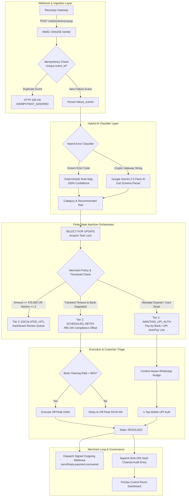

# System Design: Autonomous Mandate & Involuntary Churn Healing Engine

> **Track**: Razorpay Track 03 (Revenue Recovery)  
> **Domain**: Enterprise Financial Infrastructure & Recurring Payment Recovery

---

## 1. Executive Summary & Problem Statement

In India's recurring subscription ecosystem, **15% to 30% of recurring payment debits fail monthly**. Over **80% of these failures represent involuntary churn**—customers who love the product, but whose debits bounc due to:
1. **RBI E-Mandate Regulations**: Strict ₹15,000 auto-debit caps, card tokenization drops, and mandatory 24-hour pre-debit notifications.
2. **Bank Network Outages**: Temporary 504 timeouts and gateway congestion at issuing banks (HDFC, SBI, ICICI, Axis).
3. **NPCI Switch Drops**: Intermittent failures in bank-to-gateway communication.

**The Solution**: An autonomous financial infrastructure engine running alongside Razorpay's gateway to capture, classify, and heal broken recurring payment mandates with zero human intervention.

---

## 2. High-Level System Architecture



---

## 3. Core Data Schema Design (SQL Specification)

The engine's data model is defined in `schema.sql` across 5 relational tables:

1. **`merchant_policies`**: Configures merchant-specific circuit breakers, HITL escalation thresholds ($\ge ₹25,000$), max retries, and enabled recovery rails.
2. **`payment_mandates`**: Tracks recurring mandate metadata, card BINs, UPI AutoPay vpas, debit limits, and expiration states.
3. **`failure_events`**: Immutable append-only log of raw incoming webhook failure payloads.
4. **`recovery_tasks`**: Mutable FSM state tracking table enforcing strict state transitions.
5. **`recovery_audit_ledger`**: Cryptographically hashed audit log where every row is chained via `SHA-256(prev_hash + payload)` for auditability.

---

## 4. Finite State Machine (FSM) Transition Matrix

| Current State | Event / Trigger | Target State | Execution Guard |
| :--- | :--- | :--- | :--- |
| `DETECTED` | Ingest Webhook | `DIAGNOSING` | Verify HMAC-SHA256 & Idempotency |
| `DIAGNOSING` | Transient Error + Uptime < 85% | `SCHEDULED_RETRY` | Assert RBI 24h Pre-Debit Notice Window |
| `DIAGNOSING` | Mandate Expired / Token Dead | `AWAITING_UPI_AUTH` | Provision 1-Click UPI AutoPay Link |
| `DIAGNOSING` | Amount $\ge ₹25,000$ or Retries $\ge 2$ | `ESCALATED_HITL` | Freeze Automated Execution |
| `SCHEDULED_RETRY` | Background Retry Success | `RESOLVED` | Dispatch Signed Merchant Webhook |
| `AWAITING_UPI_AUTH` | Customer 1-Tap Authorization | `RESOLVED` | Dispatch Signed Merchant Webhook |
| `AWAITING_UPI_AUTH` | Customer Clicks "Cancel" | `EXHAUSTED` | Trigger Dunning Kill Switch |
| `ESCALATED_HITL` | Merchant Admin Approval | `AWAITING_UPI_AUTH` | Apply HITL Override Decision |

---

## 5. Production & Technical Innovations

### A. Concurrency Defense (`SELECT FOR UPDATE`)
Prevents double-debit race conditions when an automated Tier 1 background retry executes at the exact millisecond a customer taps the Tier 2 WhatsApp UPI link on their phone. Row-level locks wrap state transitions in `store.ts`.

### B. Strict AI Safety Boundary
LLMs (Google Gemini 2.5 Flash) are restricted to **parsing unstructured gateway error strings and drafting WhatsApp copy**. Money-movement decisions and state transitions are 100% owned by deterministic code.

### C. Multi-Rail Fallback Infrastructure
- **Pay-by-Bank (UPI AutoPay)**: Bypasses dead credit/debit card tokens.
- **Programmable CBDC (e-Rupee) / Stablecoin Rail**: Zero-fee instant cross-border settlement for international subscription drops.
- **Open Banking VRP Rail**: Direct Account-to-Account (A2A) variable recurring debits.

---

## 6. Verification & Automated Test Output

Run test harness:
```bash
npx tsx test_engine.ts
```
Expected output:
- **Test 1**: Webhook Signature Verification `PASSED`
- **Test 2**: Webhook Idempotency Guard `PASSED`
- **Test 3**: Pay-by-Bank UPI AutoPay Mandate Provisioning `PASSED`
- **Test 4**: Tier 3 High-Value Invoice Guardrail `PASSED`
- **Test 5**: Cryptographic SHA-256 Audit Ledger Verification `PASSED`
